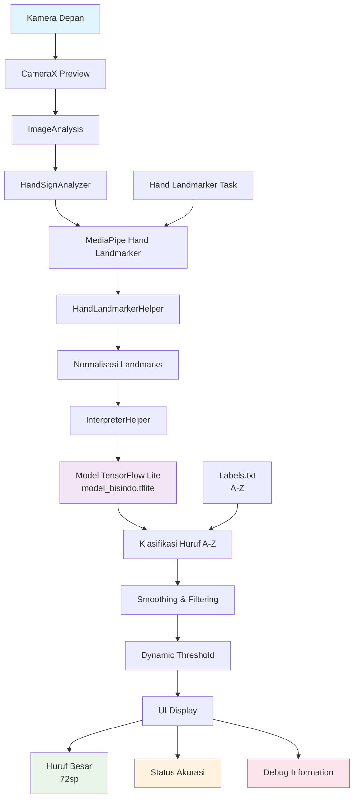
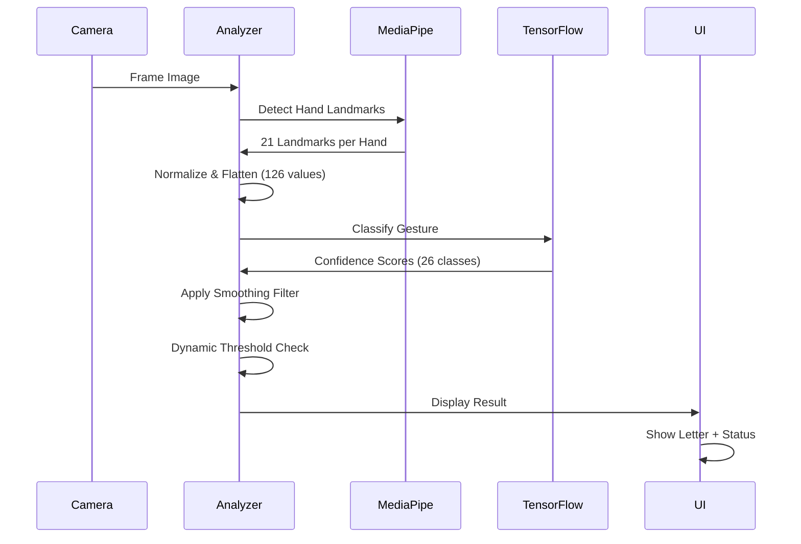

# Arsitektur Aplikasi Deteksi Bahasa Isyarat BISINDO

## Diagram Arsitektur Sistem

## Flow Deteksi Real-time

## Komponen Utama

### 1. Input Layer
- **CameraX**: Pengambilan frame real-time
- **ImageAnalysis**: Analisis frame untuk deteksi tangan

### 2. Detection Layer
- **MediaPipe Hand Landmarker**: Deteksi 21 landmark per tangan
- **HandLandmarkerHelper**: Normalisasi dan preprocessing landmarks

### 3. Classification Layer
- **TensorFlow Lite Model**: Klasifikasi gestur menjadi huruf A-Z
- **InterpreterHelper**: Interface untuk model inference

### 4. Processing Layer
- **Smoothing**: Mengurangi flickering dengan history buffer
- **Dynamic Threshold**: Menyesuaikan threshold berdasarkan confidence
- **Stability Check**: Memastikan prediksi konsisten

### 5. Display Layer
- **Large Letter Display**: Huruf dengan ukuran 72sp
- **Status Indicators**: Akurasi dengan color coding
- **Debug Panel**: Informasi real-time untuk monitoring

## Fitur Peningkatan yang Ditambahkan

### 1. Akurasi Model
- ✅ Validasi data landmarks sebelum inference
- ✅ Logging detail untuk debugging
- ✅ Pengukuran waktu inference
- ✅ Top 3 predictions logging

### 2. Threshold Dinamis
- ✅ Menyesuaikan threshold berdasarkan confidence
- ✅ Range threshold: 40% - 80%
- ✅ Adaptif terhadap kondisi deteksi

### 3. Smoothing Prediksi
- ✅ History buffer 5 frame
- ✅ Most frequent prediction
- ✅ Stability counter (min 3 frames)
- ✅ Mengurangi flickering

### 4. UI yang Responsif
- ✅ Huruf besar dengan shadow elevation
- ✅ Color-coded status indicators
- ✅ Debug toggle switch
- ✅ Real-time accuracy stats
- ✅ Detailed landmark information

### 5. Debug Features
- ✅ Toggle debug mode
- ✅ Real-time accuracy percentage
- ✅ Landmark detection rate
- ✅ Dynamic threshold display
- ✅ Stability counter
- ✅ Inference timing

## Performa Optimasi

### Memory Management
- Efficient bitmap conversion
- Proper resource cleanup
- Optimized buffer allocation

### Processing Speed
- Single thread executor untuk analyzer
- Optimized landmark normalization
- Efficient tensor buffer operations

### Accuracy Improvements
- Dynamic threshold adjustment
- Prediction smoothing
- Landmark validation
- Stability requirements

Aplikasi ini sekarang memiliki sistem deteksi bahasa isyarat yang lebih akurat, responsif, dan user-friendly dengan fitur debug yang komprehensif untuk memverifikasi performa model secara real-time.
